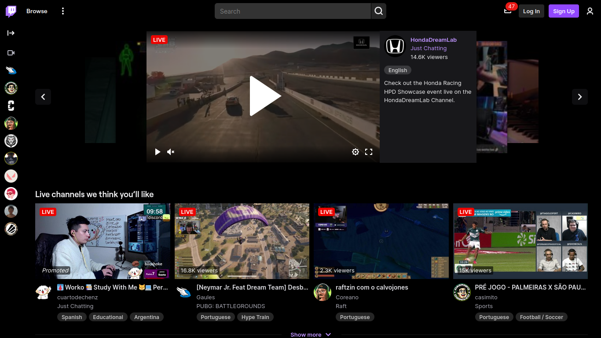

<h1 align="center">
    
    Black Twitch
</h1>

<b>The black theme for Twitch</b>

     
    
      

## Description

**Black Twitch** extension takes Twitch's Dark Theme as a base and converts it to Black Theme.

## Usage

Enable the Twitch dark theme and then install Black Twitch extension to automatically activate it.

## License

This project is lincesed under [MIT License](LICENSE).
